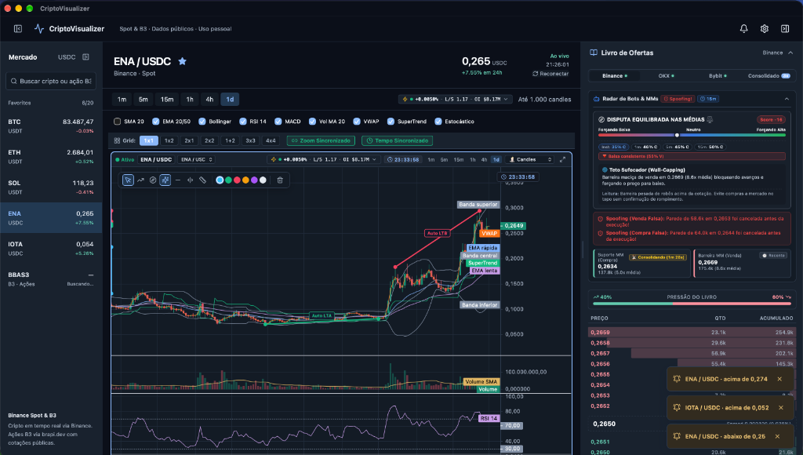
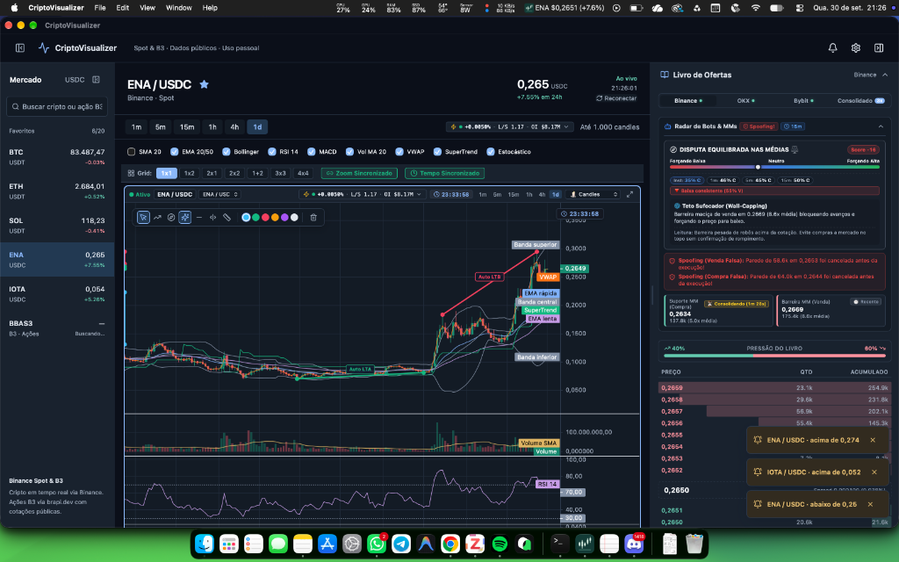
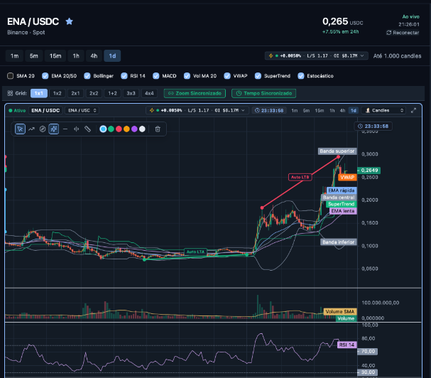
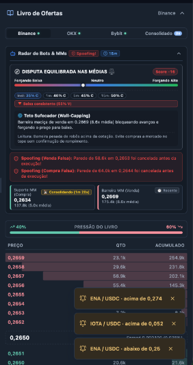
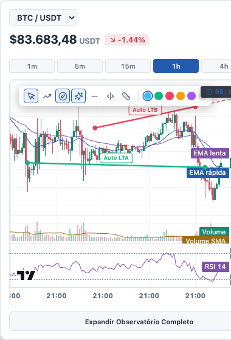
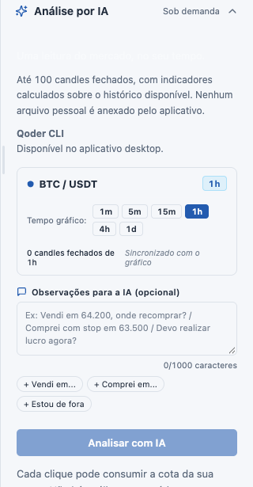

# Guia Visual e Manual de Interface do CriptoVisualizer 🖥️

Este documento descreve detalhadamente cada elemento visual, painel e componente do **CriptoVisualizer**, servindo como referência para usuários, analistas e desenvolvedores.

---

## 1. Visão Geral da Estação de Trabalho

O CriptoVisualizer foi projetado para oferecer densidade máxima de informação sem poluição visual, utilizando tema escuro de alto contraste calibrado para longas sessões de análise.

A tela principal está dividida em 4 zonas ergonômicas principais:
1. **Barra Lateral Esquerda (Watchlist & Ativos):** Navegação ágil entre criptomoedas favoritas e ações brasileiras da B3.
2. **Barra Superior & Grade de Gráficos:** Seleção de timeframes, botões de ativação de indicadores técnicos, controle de layouts de grade (`1x1` até `4x4`) e sincronização de tela.
3. **Área Gráfica Central:** Gráfico interativo TradingView (*Lightweight Charts*), camadas de médias, canais, osciladores, detecção de LTA/LTB e ferramentas de desenho livre.
4. **Painel Lateral Direito Dobrável:** Livro de Ofertas em tempo real, Radar de Bots e Market Makers com alertas de spoofing, ou Painel de Análise por IA sob demanda.

---

## 2. Integração com o macOS (Área de Trabalho e Barra de Menus)

O aplicativo foi construído com **Tauri v2** para integração profunda com o sistema operacional macOS:

### Destaques da Integração de Sistema:
- **Barra de Menus (System Tray):** Cotação em tempo real e variação percentual exibidas de forma ininterrupta diretamente na barra superior do Mac (ex: `ENA $0,2651 (+7.6%)`).
- **Controles Nativos:** Integração com os botões de controle de janela nativos do macOS (fechar, minimizar e tela cheia).
- **Sem Consumo Excessivo:** O backend nativo em Rust gerencia conexões WebSocket assíncronas, mantendo consumo de CPU e RAM mínimos em segundo plano.

---

## 3. Gráficos, Indicadores e Ferramentas Técnicas

A área central de análise gráfica foi construída para atender tanto traders de scalping quanto analistas de posição:

### Funcionalidades do Gráfico:
- **Timeframes Rápidos:** Alterne instantaneamente entre `1m`, `5m`, `15m`, `1h`, `4h` e `1d`.
- **Contador Regressivo de Fechamento:** Timer visual no canto superior do gráfico indicando a contagem regressiva precisa para a finalização do candle atual.
- **Detecção Automática de Tendências (Auto LTA & LTB):** Linhas dinâmicas calculadas por algoritmo identificando pontos de suporte ascendente (verde) e resistências descendentes (vermelho).
- **Indicadores Técnicos Integrados:**
  - `SMA 20`: Média móvel simples para identificação de suporte de tendência média.
  - `EMA 20/50`: Médias móveis exponenciais rápida e lenta para leitura de cruzamentos (*Golden/Death Cross*).
  - `Bandas de Bollinger`: Volatilidade dinâmica e limites estatísticos de desvio padrão.
  - `VWAP (Volume Weighted Average Price)`: Preço médio ponderado por volume intradiário institucional.
  - `SuperTrend`: Filtro direcional dinâmico com identificação clara de reversões.
  - `Volume SMA 20`: Histograma de volume colorido por candle com linha de média suavizada.
  - `RSI 14`: Índice de Força Relativa com zonas de sobrecompra (70) e sobrevenda (30).
  - `MACD` e `Estocástico`: Osciladores complementares de momentum e exaustão de movimento.
- **Barra Flutuante de Desenho:** Ferramentas para traçar trendlines manuais, retas horizontais de preços, linhas verticais para eventos e réguas de medição de porcentagem.
- **Grades Multi-Chart (1x1 a 4x4):** Permite acompanhar até 16 gráficos simultaneamente na mesma tela, com opções de *Zoom Sincronizado* e *Tempo Sincronizado*.

---

## 4. Livro de Ofertas & Radar de Bots / Manipulação

O motor de análise do livro de ordens monitora em milissegundos o fluxo de liquidez em busca de manobras de Market Makers e algoritmos institucionais:

### Elementos do Radar de Manipulação:
- **Disputa Equilibrada nas Médias (Score Algorítmico):** Pontuação ponderada (-100 a +100) medindo se a força dominante no livro está forçando alta, neutra ou forçando baixa em janelas de 1m, 5m e 15m.
- **Detecção de Wall-Capping (Teto Sufocador):** Identifica muralhas desproporcionais de venda criadas para segurar a cotação e absorver compras a mercado.
- **Alertas Ativos de Spoofing:** Notificações em vermelho quando ordens gigantescas são inseridas para simular liquidez e canceladas segundos antes de serem atingidas pelo preço.
- **Suporte MM & Barreira MM:** Níveis de preço com maior acúmulo de ordens institucionais e tempo contínuo de consolidação do bloco de liquidez.
- **Métrica de Pressão do Livro:** Percentual comparativo de volume de compra vs. volume de venda nos primeiros níveis da fila.
- **Alertas de Preço Dinâmicos (Toasts):** Cartões flutuantes no canto inferior direito que avisam imediatamente o atingimento ou cruzamento de metas configuradas.

---

## 5. Widget de Barra de Menus do macOS

Para momentos em que a janela principal estiver minimizada ou fechada, o **Widget Popover** permite acompanhamento instantâneo:

  

- **Abertura em 1 Clique:** Clique no ícone do menu bar do macOS para abrir o popover sem tirar o foco da sua janela de trabalho.
- **Mini Gráfico em Tempo Real:** Visualização compacta dos candles e indicadores essenciais.
- **Botão de Expansão Rápida:** O botão inferior *"Expandir Observatório Completo"* restaura e traz à frente a janela principal do CriptoVisualizer.

---

## 6. Painel de Análise por Inteligência Artificial (CLI)

O CriptoVisualizer permite acionar agentes de inteligência artificial locais (como **Qoder CLI** ou **Antigravity CLI**) para auditar o gráfico atual:

  

- **Contexto Automatizado:** Extrai os últimos candles fechados, indicadores computados, suporte/resistência, dados de derivativos/funding rate e tokenomics/taxa de desbloqueio do par selecionado.
- **Instruções Personalizadas:** Permite adicionar anotações ("Comprei em X, onde posicionar o stop?") ou utilizar atalhos rápidos.
- **Privacidade Total:** Execução realizada diretamente na máquina do usuário via terminal/CLI ou chamada direta de API autenticada.

---

## 7. Tokenomics & Desbloqueio de Tokens (Unlocks & Vesting)

O CriptoVisualizer integra um observatório de tokenomics para alertar o trader sobre inflação de supply e pressão vendedora decorrente de destravamentos (*token unlocks*):

- **Badge de Tokenomics no Gráfico:** Exibe a porcentagem do supply em circulação e uma tag de risco dinâmico (`Baixo`, `Moderado` ou `Crítico`).
- **Popover e Seção Lateral:**
  - **Barra de Supply:** Visualização gráfica da proporção entre supply circulante vs. supply bloqueado em vesting.
  - **Contagem Regressiva de Cliff:** Data prevista e contagem de dias restantes para o próximo evento relevante de desbloqueio.
  - **Volume & Valor em Dólar:** Quantidade exata de tokens a serem liberados e seu impacto financeiro estimado em USD.
  - **Classificação de Diluição:**
    - `Baixo`: Mais de 75% do suprimento já circula no mercado e sem desbloqueios iminentes.
    - `Moderado`: Entre 40% e 75% circulante, ou desbloqueio previsto para os próximos 30 dias.
    - `Crítico`: Menos de 40% do supply circulante (risco agudo de desvalorização contínua de longo prazo).

---

## 8. Provedores de Inteligência Artificial Suportados

O usuário pode escolher nas configurações (`⌘,` ou ícone de engrenagem) entre três modalidades de agente:

1. **OpenAI API:** Conexão direta via chave de API (`sk-...`) com seleção de modelo (`gpt-4o-mini`, `gpt-4o`, `o3-mini`, `o1` ou endpoint customizado compatível). Opera em modo JSON estruturado de altíssima velocidade.
2. **Antigravity CLI:** Acionamento de agente local no terminal da máquina sem custo de API externa.
3. **Qoder CLI:** Agente local alternativo para usuários que operam com o stack Qoder.

